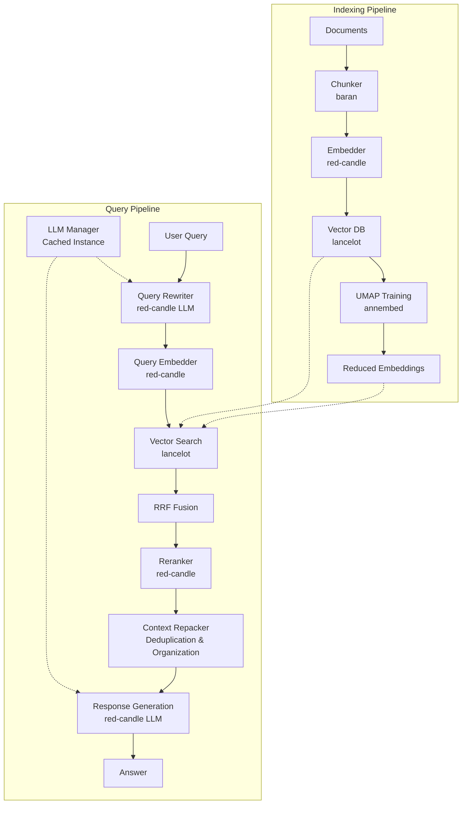
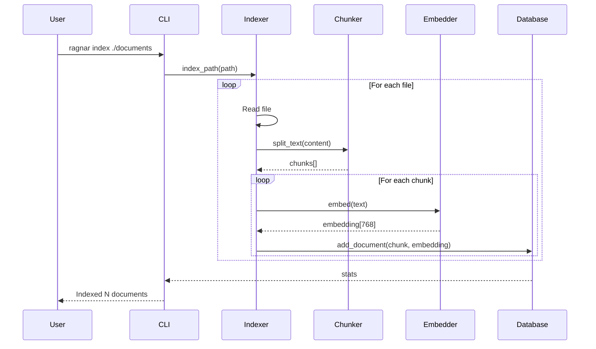
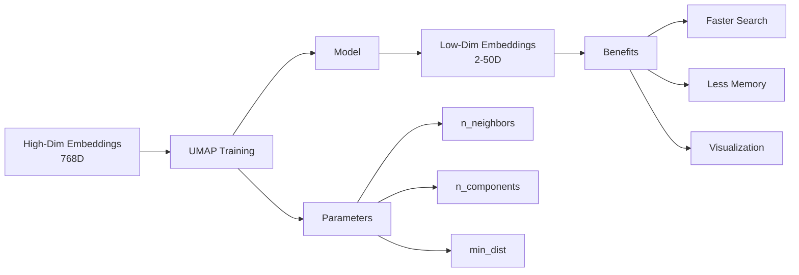
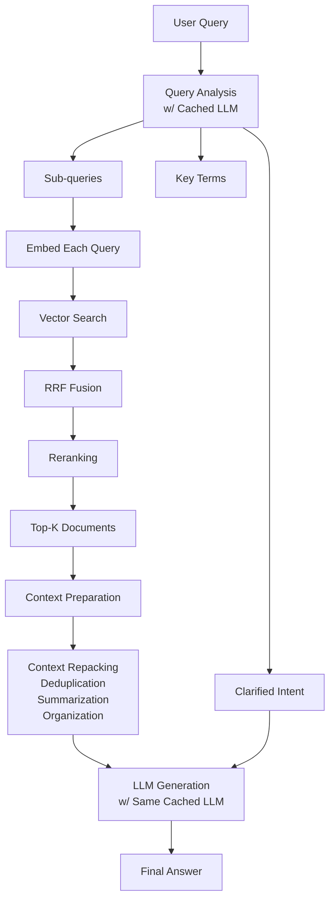

A complete Ruby implementation of Retrieval-Augmented Generation (RAG) pipeline using native Ruby ML/NLP gems.

## Overview

Ragnar provides a production-ready RAG pipeline for Ruby applications, integrating:
- **red-candle**: LLM inference, embeddings, and reranking
- **lancelot**: Vector database with Lance columnar storage
- **clusterkit**: UMAP dimensionality reduction and clustering
- **baran**: Text chunking and splitting

## Architecture

### Complete RAG Pipeline



### Indexing Process



### UMAP Dimensionality Reduction



### Query Processing Pipeline



## Installation

### As a Gem

```bash
gem install ragnar-cli
```

### From Source

```bash
git clone https://github.com/cpetersen/ragnar-cli.git
cd ragnar-cli
bundle install
gem build ragnar.gemspec
gem install ./ragnar-*.gem
```

## Quick Start

### 1. Index Documents

```bash
# Index a directory of text files
ragnar index ./documents

# Index with custom settings
ragnar index ./documents \
  --chunk-size 1000 \
  --chunk-overlap 100
```

### 2. Train UMAP (Optional)

Reduce embedding dimensions for faster search:

```bash
# Train UMAP model (auto-adjusts parameters based on data)
ragnar train-umap \
  --n-components 50 \
  --n-neighbors 15

# Apply to all embeddings
ragnar apply-umap
```

### 3. Extract Topics

Perform topic modeling to discover themes in your indexed documents:

```bash
# Basic topic extraction (requires minimum 20-30 indexed documents)
ragnar topics

# Adjust clustering parameters for smaller datasets
ragnar topics --min-cluster-size 3  # Allow smaller topics
ragnar topics --min-samples 2       # Less strict density requirements

# Export visualizations
ragnar topics --export html  # Interactive D3.js visualization
ragnar topics --export json  # JSON data for further processing

# Verbose mode for debugging
ragnar topics --verbose
```

**Note**: Topic modeling requires sufficient documents to identify meaningful patterns. For best results:
- Index at least 20-30 documents (ideally 50+)
- Ensure documents cover diverse topics
- Documents should be substantial (50+ words each)

The HTML export includes:
- **Topic Bubbles**: Interactive bubble chart showing topic sizes and coherence
- **Embedding Scatter Plot**: Visualization of all documents in embedding space, colored by cluster

### 4. Query the System

```bash
# Basic query
ragnar query "What is the main purpose of this project?"

# Verbose mode shows all intermediate processing steps
ragnar query "How does the chunking process work?" --verbose
# Or use short form
ragnar query "How does the chunking process work?" -v

# JSON output for programmatic use
ragnar query "Explain the embedding model" --json

# Adjust number of retrieved documents
ragnar query "What are the key features?" --top-k 5

# Combine options for detailed analysis
ragnar query "Compare Ruby with Python" -v --top-k 5
```

#### Verbose Mode Output

When using `--verbose` or `-v`, you'll see:
1. **Query Analysis**: Original query, clarified intent, sub-queries, and key terms
2. **Document Retrieval**: Each sub-query's embedding and search results
3. **RRF Fusion**: How multiple search results are combined
4. **Reranking**: Top documents after relevance scoring
5. **Context Repacking**: How retrieved chunks are organized and compressed
6. **Response Generation**: The final LLM prompt and response
7. **Final Results**: Confidence score and source attribution

### 5. Check Statistics

```bash
ragnar stats
```

## Features

### Intelligent Query Processing

1. **Query Rewriting**: Clarifies intent and generates sub-queries
2. **Multi-Query Search**: Searches with multiple query variations
3. **RRF Fusion**: Combines results using Reciprocal Rank Fusion
4. **Reranking**: Uses cross-encoder for precise relevance scoring
5. **Context Repacking**: Deduplicates and organizes retrieved chunks for optimal LLM consumption
6. **LLM Caching**: Single LLM instance shared between query rewriting and response generation
7. **Contextual Response**: Generates answers with LLM based on repacked context

### Embedding Management

- **High-dimensional embeddings** (768D) for semantic accuracy
- **UMAP reduction** to lower dimensions (2-50D) for efficiency
- **Automatic parameter adjustment** based on dataset size
- **Batch processing** for large document collections

### Database Features

- **Lance columnar format** for efficient storage
- **Vector similarity search** with configurable metrics
- **Metadata tracking** for source attribution
- **Incremental indexing** support

## Configuration

### Default Settings

```ruby
DEFAULT_DB_PATH = "ragnar_database"
DEFAULT_CHUNK_SIZE = 512
DEFAULT_CHUNK_OVERLAP = 50
DEFAULT_EMBEDDING_MODEL = "jinaai/jina-embeddings-v2-base-en"
```

### Supported Models

**Embedding Models** (via red-candle):
- jinaai/jina-embeddings-v2-base-en
- BAAI/bge-base-en-v1.5
- sentence-transformers/all-MiniLM-L6-v2

**LLM Models** (via red-candle):
- Qwen/Qwen2.5-1.5B-Instruct
- microsoft/phi-2
- TinyLlama/TinyLlama-1.1B-Chat-v1.0

**Reranker Models** (via red-candle):
- BAAI/bge-reranker-base
- cross-encoder/ms-marco-MiniLM-L-6-v2

## Advanced Usage

### Programmatic API

```ruby
require 'ragnar'

# Initialize components
indexer = Ragnar::Indexer.new(
  db_path: "my_database",
  chunk_size: 1000
)

# Index documents
stats = indexer.index_path("./documents")

# Query the system
processor = Ragnar::QueryProcessor.new(db_path: "my_database")
result = processor.query(
  "What is Ruby?",
  top_k: 5,
  verbose: true
)

puts result[:answer]
puts "Confidence: #{result[:confidence]}%"
```

### Topic Modeling

Extract topics from your indexed documents:

```ruby
# Example with sufficient documents for clustering (minimum ~20-30 needed)
documents = [
  # Finance cluster
  "Federal Reserve raises interest rates to combat inflation",
  "Stock markets rally on positive earnings reports", 
  "Cryptocurrency markets show increased volatility",
  "Corporate bonds yield higher returns this quarter",
  "Central banks coordinate global monetary policy",
  
  # Technology cluster  
  "AI breakthrough in natural language processing announced",
  "Machine learning transforms healthcare diagnostics",
  "Cloud computing adoption accelerates in enterprises",
  "Quantum computing reaches new error correction milestone",
  "Open source frameworks receive major updates",
  
  # Healthcare cluster
  "Clinical trials show promise for cancer immunotherapy",
  "Telemedicine reshapes patient care delivery models",
  "Gene editing advances treatment for rare diseases",
  "Mental health awareness campaigns gain momentum",
  "mRNA vaccine technology platform expands",
  
  # Add more documents for better clustering...
  # See TOPIC_MODELING_EXAMPLE.md for complete example
]

# Extract topics using Topical
database = Ragnar::Database.new("ragnar_database")
docs = database.get_all_documents_with_embeddings

embeddings = docs.map { |d| d[:embedding] }
texts = docs.map { |d| d[:chunk_text] }

topics = Topical.extract(
  embeddings: embeddings,
  documents: texts,
  min_topic_size: 3  # Minimum docs per topic
)

topics.each do |topic|
  puts "Topic: #{topic.label}"
  puts "Terms: #{topic.terms.join(', ')}"
  puts "Size: #{topic.size} documents\n\n"
end
```

For a complete working example with 40+ documents, see [TOPIC_MODELING_EXAMPLE.md](TOPIC_MODELING_EXAMPLE.md).

### Custom Chunking Strategies

```ruby
chunker = Ragnar::Chunker.new(
  chunk_size: 1000,
  chunk_overlap: 200,
  separators: ["\n\n", "\n", ". ", " "]
)

chunks = chunker.chunk_text(document_text)
```

### Embedding Optimization

```ruby
# For small datasets (<100 documents)
processor = Ragnar::UmapProcessor.new
processor.train(
  n_components: 10,  # Fewer components
  n_neighbors: 5,    # Fewer neighbors
  min_dist: 0.05     # Tighter clusters
)

# For large datasets (>10,000 documents)
processor.train(
  n_components: 50,  # More components
  n_neighbors: 30,   # More neighbors
  min_dist: 0.1      # Standard distance
)
```

## Performance Considerations

### Memory Usage

- **Indexing**: ~100MB per 1000 documents (768D embeddings)
- **UMAP Training**: ~80MB for 10,000 vectors
- **Query Processing**: ~50MB overhead for models (reduced with LLM caching)
- **LLM Caching**: Single model instance (~500MB-2GB depending on model size)

### Speed Benchmarks

- **Indexing**: ~10 documents/second (including embedding)
- **UMAP Training**: 30-60 seconds for 10,000 vectors
- **Query Processing**: 1-3 seconds per query (faster with cached LLM)
- **Vector Search**: <100ms for 100,000 vectors
- **Context Repacking**: <50ms for typical document sets
- **LLM Loading**: 2-5 seconds (only on first query with caching)

### Optimization Tips

1. **Use UMAP** for datasets >1000 documents
2. **Batch index** large document collections
3. **Cache embeddings** for repeated queries
4. **Adjust chunk size** based on document type:
   - Technical docs: 500-1000 tokens
   - Narrative text: 200-500 tokens
   - Q&A content: 100-300 tokens

## Troubleshooting

### Common Issues

**UMAP fails with "index out of bounds"**
- Cause: Too few samples for the requested parameters
- Solution: System auto-adjusts, but you can manually set lower n_neighbors

**Slow indexing performance**
- Try smaller chunk sizes
- Use batch processing
- Consider using a faster embedding model

**Poor query results**
- Index more documents (RAG works best with 100+ documents)
- Adjust chunk size and overlap
- Try different embedding models

## Development

```bash
# Install dependencies
bundle install

# Run tests
bundle exec rspec

# Build gem
gem build ragnar.gemspec
```

## Architecture Details

### Component Responsibilities

| Component | Purpose | Key Methods |
|-----------|---------|-------------|
| Chunker | Split text into semantic chunks | `chunk_text()` |
| Embedder | Generate vector embeddings | `embed_text()`, `embed_batch()` |
| Database | Store and search vectors | `add_document()`, `search_similar()` |
| LLMManager | Cache and manage LLM instances | `get_llm()`, `default_llm()` |
| ContextRepacker | Optimize retrieved context | `repack()`, `repack_with_summary()` |
| QueryRewriter | Analyze and expand queries | `rewrite()` |
| QueryProcessor | Orchestrate query pipeline | `query()` |
| UmapProcessor | Reduce embedding dimensions | `train()`, `apply()` |

### Data Flow

1. **Documents** → Chunker → Text chunks
2. **Text chunks** → Embedder → Embeddings (768D)
3. **Embeddings** → Database → Stored vectors
4. **Stored vectors** → UMAP → Reduced vectors (2-50D)
5. **Query** → Rewriter (w/ cached LLM) → Sub-queries
6. **Sub-queries** → Embedder → Query vectors
7. **Query vectors** → Database → Similar documents
8. **Documents** → Reranker → Top results
9. **Top results** → Context Repacker → Optimized context
10. **Optimized context** → LLM (same cached instance) → Final answer

## Contributing

Contributions are welcome! Please:

1. Fork the repository
2. Create a feature branch
3. Add tests for new functionality
4. Ensure all tests pass
5. Submit a pull request

## License

MIT License - see LICENSE file for details

## Acknowledgments

This project integrates several excellent Ruby gems:
- [red-candle](https://github.com/assaydepot/red-candle) - Ruby ML/LLM toolkit
- [lancelot](https://github.com/cpetersen/lancelot) - Lance database bindings
- [clusterkit](https://github.com/cpetersen/clusterkit) - UMAP and clustering implementation
- [parsekit](https://github.com/cpetersen/parsekit) - Content extraction
- [baran](https://github.com/moeki0/baran) - Text splitting utilities
