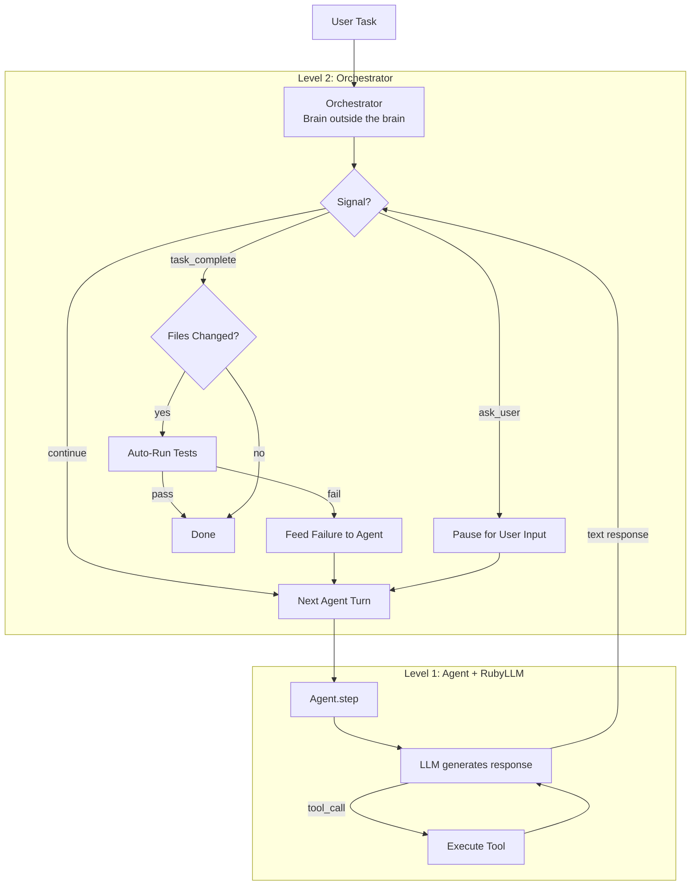
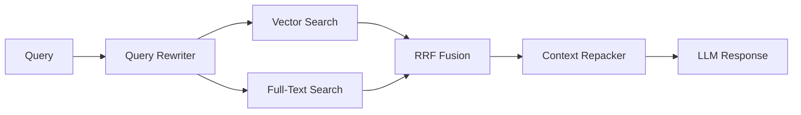

An agentic coding assistant for Ruby — built with Ruby, for Ruby developers to learn from.

<p align="center">
  
</p>

## What Is This?

Ragnar is a hackable, Claude Code-style coding agent written entirely in Ruby. It can read your files, write code, run commands, search your codebase, and self-correct when tests fail — all driven by an LLM through a two-level agentic loop.

**This is not a production competitor to Claude Code.** It's a teaching tool. The goal is to let a Ruby developer read ~1,400 lines of code and understand exactly how an agentic coding assistant works:

- **Tools are just Ruby classes** — inherit from `RubyLLM::Tool`, implement `execute`
- **Level 1 is free** — `chat.ask()` handles the tool call → execute → feed back loop automatically
- **Level 2 is the interesting part** — the Orchestrator decides what to do between LLM turns (run tests, feed failures back, detect completion)
- **RAG is just another tool** — the agent can search an indexed knowledge base alongside reading files and running commands
- **Profiles make it practical** — use a local Qwen3-4B for cheap iteration, switch to Opus for the real work

## Architecture

### Two-Level Agentic Loop


```mermaid
flowchart TB
    User[User Task] --> Orchestrator

    subgraph "Level 2: Orchestrator"
        Orchestrator[Orchestrator<br/>Brain outside the brain]
        Orchestrator --> Check{Signal?}
        Check -->|task_complete| Validate
        Check -->|ask_user| Pause[Pause for User Input]
        Check -->|continue| NextTurn[Next Agent Turn]
        Validate{Files Changed?} -->|yes| RunTests[Auto-Run Tests]
        RunTests -->|pass| Done[Done]
        RunTests -->|fail| FeedBack[Feed Failure to Agent]
        FeedBack --> NextTurn
        Validate -->|no| Done
        Pause --> NextTurn
    end

    subgraph "Level 1: Agent + RubyLLM"
        NextTurn --> Agent[Agent.step]
        Agent --> LLM[LLM generates response]
        LLM -->|tool_call| Execute[Execute Tool]
        Execute --> LLM
        LLM -->|text response| Check
    end
```

**Level 1** (handled by RubyLLM): The LLM makes tool calls within a single turn — read a file, write code, run a command. RubyLLM executes each tool and feeds the result back automatically.

**Level 2** (the Orchestrator): Between LLM turns, the orchestrator auto-detects the project type, runs tests, and feeds failures back. The LLM doesn't ask to run tests — the orchestrator does it. This is what makes it feel like a coding assistant rather than a chatbot with tools.

### Tools

| Tool | What It Does |
|------|-------------|
| `ReadFile` | Read files with line numbers, offset/limit |
| `WriteFile` | Create or overwrite files |
| `EditFile` | Search-and-replace with uniqueness validation |
| `BashExec` | Shell commands with safety blocklist |
| `ListFiles` | Glob-based file search |
| `Grep` | ripgrep/grep content search |
| `TaskComplete` | Agent signals "I'm done" (uses RubyLLM `halt`) |
| `AskUser` | Agent asks for clarification (uses RubyLLM `halt`) |

### RAG Pipeline

Ragnar also includes a full RAG (Retrieval-Augmented Generation) pipeline for querying indexed documents:


```mermaid
flowchart LR
    Q[Query] --> Rewrite[Query Rewriter]
    Rewrite --> VS[Vector Search]
    Rewrite --> FTS[Full-Text Search]
    VS --> RRF[RRF Fusion]
    FTS --> RRF
    RRF --> Context[Context Repacker]
    Context --> LLM[LLM Response]
```

- **Hybrid search**: Vector embeddings (semantic) + full-text search (keyword) combined via Reciprocal Rank Fusion
- **Query rewriting**: LLM breaks complex queries into sub-queries
- **Configurable reranking**: Cross-encoder reranking (optional, configurable per-project)

## Installation

```bash
gem install ragnar-cli
```

Or from source:

```bash
git clone https://github.com/scientist-labs/ragnar-cli.git
cd ragnar-cli
bundle install
```

## Quick Start

### 1. Agentic Coding Mode

The main feature — give ragnar a task and it writes code:

```bash
# Use Claude Opus for best results
ragnar --profile opus code "Write a Ruby script that implements FizzBuzz and run it"

# Use a local model (free, no API key needed)
ragnar code "Create a hello world script in /tmp and run it"
```

In the TUI:
```
ragnar> /profile opus
ragnar> /code Add error handling to lib/parser.rb with tests
```

The agent will read files, write code, run commands, and call `task_complete` when done. If tests fail, the orchestrator feeds the failure back and the agent self-corrects.

### 2. Interactive TUI

Running `ragnar` with no arguments launches a ratatui-based TUI:

```bash
ragnar
```

The TUI provides:
- **Auto-completion** for commands and options
- **Persistent history** across sessions
- **`/code`** — agentic coding mode
- **`/query`** — RAG-powered document Q&A
- **`/verbose`** — toggle verbose output
- **`/profile`** — switch LLM profiles mid-session
- **All CLI commands** via `/command` syntax

### 3. RAG Document Q&A

Index documents and query them with LLM-powered answers:

```bash
# Index a directory
ragnar index ./documents

# Query with hybrid search
ragnar query "What is our password policy?"

# Verbose mode shows the full pipeline
ragnar query -v "How does authentication work?"
```

### 4. Other Commands

```bash
ragnar stats                    # Database statistics
ragnar config                   # Show configuration
ragnar profile                  # List LLM profiles
ragnar umap train               # Train UMAP model
ragnar topics                   # Topic modeling
ragnar topics --export html     # Interactive visualization
```

## Configuration

Ragnar uses YAML configuration with smart defaults:

```yaml
# .ragnar.yml
llm:
  default_profile: red_candle
  profiles:
    red_candle:
      provider: red_candle
      model: MaziyarPanahi/Qwen3-4B-GGUF
    opus:
      provider: anthropic
      model: claude-opus-4-6
      api_key: sk-ant-...     # or set ANTHROPIC_API_KEY env var
    sonnet:
      provider: anthropic
      model: claude-sonnet-4-6
    ollama:
      provider: ollama
      model: llama3.1:8b

query:
  top_k: 3
  enable_reranking: false       # disable for small/homogeneous corpora
  reranker_model: BAAI/bge-reranker-base

embeddings:
  model: jinaai/jina-embeddings-v2-base-en
  chunk_size: 512
  chunk_overlap: 50
```

Generate a config file: `ragnar init-config`

### LLM Profiles

Profiles let you switch models without editing config:

```bash
ragnar --profile opus code "Refactor the auth module"
ragnar --profile red_candle query "What does this function do?"
```

Ragnar supports any [RubyLLM](https://rubyllm.com/) provider: `red_candle` (local), `anthropic`, `openai`, `ollama`, and [more](https://rubyllm.com/providers/).

## How It Works (For Developers)

The entire agent is ~1,400 lines across a few key files:

| File | Lines | What It Does |
|------|-------|-------------|
| `lib/ragnar/tools/*.rb` | ~310 | 8 tool classes — each is a `RubyLLM::Tool` with `execute` |
| `lib/ragnar/agent.rb` | ~114 | Persistent RubyLLM chat with tools registered |
| `lib/ragnar/orchestrator.rb` | ~163 | Level 2 loop: iteration management, auto-validation, signal detection |
| `lib/ragnar/query_processor.rb` | ~450 | RAG pipeline: hybrid search, RRF, reranking, context repacking |
| `lib/ragnar/config.rb` | ~320 | YAML config with LLM profiles |

### Key Design Decisions

**Tool-based completion signaling**: The agent calls `TaskComplete` (a tool) instead of saying "I'm done" in prose. RubyLLM's `halt` mechanism stops the tool loop immediately. This replaced a fragile string-matching heuristic that caused 6 unnecessary iterations.

**Orchestrator-driven validation**: The LLM doesn't decide to run tests — the orchestrator detects file changes and runs `bundle exec rspec` (or `cargo test`, `npm test`, `pytest`) automatically. Failed tests are fed back to the agent as context for the next turn.

**Hybrid search for RAG**: Vector search (semantic) + full-text search (keyword) combined via RRF. This solved a real problem where vector search missed exact keyword matches in domain-specific corpora.

**Fresh chat per RAG query, persistent chat for agent**: RAG queries create isolated chats (prevents context bleed between unrelated queries). The agent maintains conversation history across turns (needed for multi-step tasks).

## Built With

| Gem | Purpose |
|-----|---------|
| [RubyLLM](https://rubyllm.com/) | Multi-provider LLM interface (the brains) |
| [ruby_llm-red_candle](https://github.com/scientist-labs/ruby_llm-red_candle) | Local GGUF model execution |
| [red-candle](https://github.com/assaydepot/red-candle) | Embeddings and reranking (Rust/Candle) |
| [lancelot](https://github.com/scientist-labs/lancelot) | Vector database (Lance columnar storage) |
| [thor-interactive](https://github.com/scientist-labs/thor-interactive) | TUI framework for Thor CLIs |
| [ratatui_ruby](https://github.com/nicholasgasior/ratatui-ruby) | Terminal UI (Rust/ratatui) |
| [clusterkit](https://github.com/scientist-labs/clusterkit) | UMAP dimensionality reduction |
| [parsekit](https://github.com/scientist-labs/parsekit) | Document parsing (PDF, DOCX, etc.) |

## Development

```bash
bundle install
bundle exec rspec       # 387 specs
```

## License

MIT License - see LICENSE file for details
