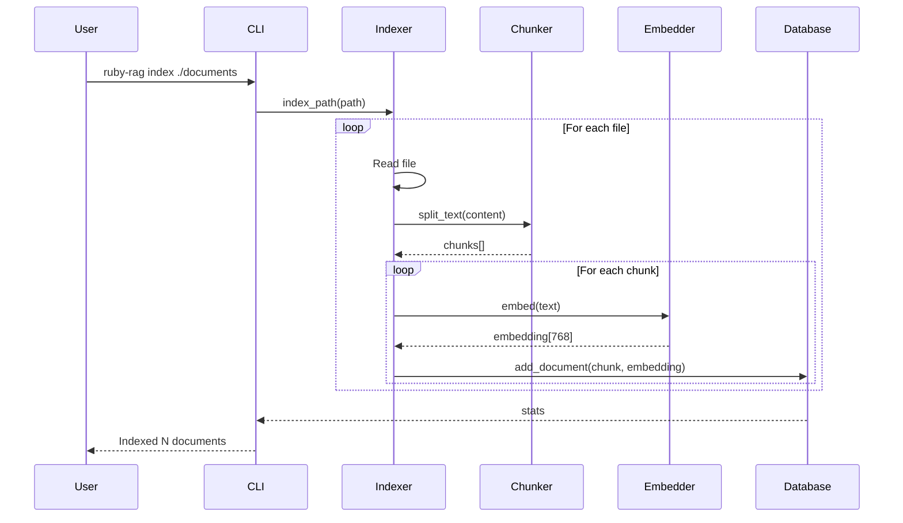

# RubyRag

A complete Ruby implementation of Retrieval-Augmented Generation (RAG) pipeline using native Ruby ML/NLP gems.

## Overview

RubyRag provides a production-ready RAG pipeline for Ruby applications, integrating:
- **red-candle**: LLM inference, embeddings, and reranking
- **lancelot**: Vector database with Lance columnar storage  
- **annembed-ruby**: UMAP dimensionality reduction
- **baran**: Text chunking and splitting

## Architecture

### Complete RAG Pipeline


### Indexing Process



### UMAP Dimensionality Reduction


### Query Processing Pipeline


## Installation

```bash
bundle install
```

## Quick Start

### 1. Index Documents

```bash
# Index a directory of text files
./bin/ruby-rag index ./documents

# Index with custom settings
./bin/ruby-rag index ./documents \
  --chunk-size 1000 \
  --chunk-overlap 100
```

### 2. Train UMAP (Optional)

Reduce embedding dimensions for faster search:

```bash
# Train UMAP model (auto-adjusts parameters based on data)
./bin/ruby-rag train-umap \
  --n-components 50 \
  --n-neighbors 15

# Apply to all embeddings
./bin/ruby-rag apply-umap
```

### 3. Query the System

```bash
# Basic query
./bin/ruby-rag query "What is the main purpose of this project?"

# Verbose mode shows all intermediate processing steps
./bin/ruby-rag query "How does the chunking process work?" --verbose
# Or use short form
./bin/ruby-rag query "How does the chunking process work?" -v

# JSON output for programmatic use
./bin/ruby-rag query "Explain the embedding model" --json

# Adjust number of retrieved documents
./bin/ruby-rag query "What are the key features?" --top-k 5

# Combine options for detailed analysis
./bin/ruby-rag query "Compare Ruby with Python" -v --top-k 5
```

#### Verbose Mode Output

When using `--verbose` or `-v`, you'll see:
1. **Query Analysis**: Original query, clarified intent, sub-queries, and key terms
2. **Document Retrieval**: Each sub-query's embedding and search results
3. **RRF Fusion**: How multiple search results are combined
4. **Reranking**: Top documents after relevance scoring
5. **Context Repacking**: How retrieved chunks are organized and compressed
6. **Response Generation**: The final LLM prompt and response
7. **Final Results**: Confidence score and source attribution

### 4. Check Statistics

```bash
./bin/ruby-rag stats
```

## Features

### Intelligent Query Processing

1. **Query Rewriting**: Clarifies intent and generates sub-queries
2. **Multi-Query Search**: Searches with multiple query variations
3. **RRF Fusion**: Combines results using Reciprocal Rank Fusion
4. **Reranking**: Uses cross-encoder for precise relevance scoring
5. **Context Repacking**: Deduplicates and organizes retrieved chunks for optimal LLM consumption
6. **LLM Caching**: Single LLM instance shared between query rewriting and response generation
7. **Contextual Response**: Generates answers with LLM based on repacked context

### Embedding Management

- **High-dimensional embeddings** (768D) for semantic accuracy
- **UMAP reduction** to lower dimensions (2-50D) for efficiency
- **Automatic parameter adjustment** based on dataset size
- **Batch processing** for large document collections

### Database Features

- **Lance columnar format** for efficient storage
- **Vector similarity search** with configurable metrics
- **Metadata tracking** for source attribution
- **Incremental indexing** support

## Configuration

### Default Settings

```ruby
DEFAULT_DB_PATH = "rag_database"
DEFAULT_CHUNK_SIZE = 512
DEFAULT_CHUNK_OVERLAP = 50
DEFAULT_EMBEDDING_MODEL = "jinaai/jina-embeddings-v2-base-en"
```

### Supported Models

**Embedding Models** (via red-candle):
- jinaai/jina-embeddings-v2-base-en
- BAAI/bge-base-en-v1.5
- sentence-transformers/all-MiniLM-L6-v2

**LLM Models** (via red-candle):
- Qwen/Qwen2.5-1.5B-Instruct
- microsoft/phi-2
- TinyLlama/TinyLlama-1.1B-Chat-v1.0

**Reranker Models** (via red-candle):
- BAAI/bge-reranker-base
- cross-encoder/ms-marco-MiniLM-L-6-v2

## Advanced Usage

### Programmatic API

```ruby
require 'ruby_rag'

# Initialize components
indexer = RubyRag::Indexer.new(
  db_path: "my_database",
  chunk_size: 1000
)

# Index documents
stats = indexer.index_path("./documents")

# Query the system
processor = RubyRag::QueryProcessor.new(db_path: "my_database")
result = processor.query(
  "What is Ruby?",
  top_k: 5,
  verbose: true
)

puts result[:answer]
puts "Confidence: #{result[:confidence]}%"
```

### Custom Chunking Strategies

```ruby
chunker = RubyRag::Chunker.new(
  chunk_size: 1000,
  chunk_overlap: 200,
  separators: ["\n\n", "\n", ". ", " "]
)

chunks = chunker.chunk_text(document_text)
```

### Embedding Optimization

```ruby
# For small datasets (<100 documents)
processor = RubyRag::UmapProcessor.new
processor.train(
  n_components: 10,  # Fewer components
  n_neighbors: 5,    # Fewer neighbors
  min_dist: 0.05     # Tighter clusters
)

# For large datasets (>10,000 documents)
processor.train(
  n_components: 50,  # More components
  n_neighbors: 30,   # More neighbors
  min_dist: 0.1      # Standard distance
)
```

## Performance Considerations

### Memory Usage

- **Indexing**: ~100MB per 1000 documents (768D embeddings)
- **UMAP Training**: ~80MB for 10,000 vectors
- **Query Processing**: ~50MB overhead for models (reduced with LLM caching)
- **LLM Caching**: Single model instance (~500MB-2GB depending on model size)

### Speed Benchmarks

- **Indexing**: ~10 documents/second (including embedding)
- **UMAP Training**: 30-60 seconds for 10,000 vectors
- **Query Processing**: 1-3 seconds per query (faster with cached LLM)
- **Vector Search**: <100ms for 100,000 vectors
- **Context Repacking**: <50ms for typical document sets
- **LLM Loading**: 2-5 seconds (only on first query with caching)

### Optimization Tips

1. **Use UMAP** for datasets >1000 documents
2. **Batch index** large document collections
3. **Cache embeddings** for repeated queries
4. **Adjust chunk size** based on document type:
   - Technical docs: 500-1000 tokens
   - Narrative text: 200-500 tokens
   - Q&A content: 100-300 tokens

## Troubleshooting

### Common Issues

**UMAP fails with "index out of bounds"**
- Cause: Too few samples for the requested parameters
- Solution: System auto-adjusts, but you can manually set lower n_neighbors

**Slow indexing performance**
- Try smaller chunk sizes
- Use batch processing
- Consider using a faster embedding model

**Poor query results**
- Index more documents (RAG works best with 100+ documents)
- Adjust chunk size and overlap
- Try different embedding models

## Development

```bash
# Install dependencies
bundle install

# Run tests
bundle exec rspec

# Build gem
gem build ruby-rag.gemspec
```

## Architecture Details

### Component Responsibilities

| Component | Purpose | Key Methods |
|-----------|---------|-------------|
| Chunker | Split text into semantic chunks | `chunk_text()` |
| Embedder | Generate vector embeddings | `embed_text()`, `embed_batch()` |
| Database | Store and search vectors | `add_document()`, `search_similar()` |
| LLMManager | Cache and manage LLM instances | `get_llm()`, `default_llm()` |
| ContextRepacker | Optimize retrieved context | `repack()`, `repack_with_summary()` |
| QueryRewriter | Analyze and expand queries | `rewrite()` |
| QueryProcessor | Orchestrate query pipeline | `query()` |
| UmapProcessor | Reduce embedding dimensions | `train()`, `apply()` |

### Data Flow

1. **Documents** → Chunker → Text chunks
2. **Text chunks** → Embedder → Embeddings (768D)
3. **Embeddings** → Database → Stored vectors
4. **Stored vectors** → UMAP → Reduced vectors (2-50D)
5. **Query** → Rewriter (w/ cached LLM) → Sub-queries
6. **Sub-queries** → Embedder → Query vectors
7. **Query vectors** → Database → Similar documents
8. **Documents** → Reranker → Top results
9. **Top results** → Context Repacker → Optimized context
10. **Optimized context** → LLM (same cached instance) → Final answer

## Contributing

Contributions are welcome! Please:

1. Fork the repository
2. Create a feature branch
3. Add tests for new functionality
4. Ensure all tests pass
5. Submit a pull request

## License

MIT License - see LICENSE file for details

## Acknowledgments

This project integrates several excellent Ruby gems:
- [red-candle](https://github.com/red-candle) - Ruby ML/LLM toolkit
- [lancelot](https://github.com/lancelot) - Lance database bindings
- [annembed-ruby](https://github.com/annembed-ruby) - UMAP implementation
- [baran](https://github.com/baran) - Text splitting utilities

## Roadmap

- [ ] Add support for PDF and HTML documents
- [ ] Implement incremental indexing
- [ ] Add conversation memory for multi-turn queries
- [ ] Support for hybrid search (vector + keyword)
- [ ] Web UI for interactive queries
- [ ] Docker containerization
- [ ] Performance benchmarking suite
- [ ] Support for multiple embedding models simultaneously
- [ ] Query result caching
- [ ] Automatic index optimization